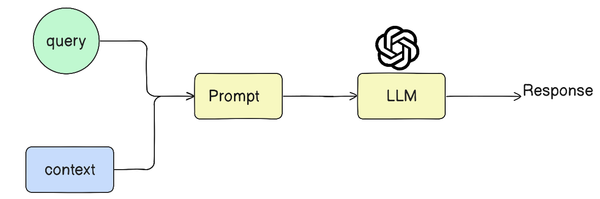

---

### Key Concepts and Definitions

- **RAG** is a technique combining **information retrieval** and **text generation** to make language models smarter by injecting relevant external knowledge dynamically at query time.
- RAG addresses three core problems faced by LLMs:
  1. **Inability to answer queries on private data** not seen during model pre-training.
  2. **Knowledge cut-off problem**, where LLMs cannot provide answers based on very recent data or events.
  3. **Hallucination**, where LLMs confidently generate factually incorrect or fabricated information.

---

### Background: How LLMs Work and Their Limitations

- LLMs are **transformer-based neural networks** with billions of parameters storing the world knowledge in their weights; this is called **parametric knowledge**.
- Users query LLMs with prompts; the model generates answers based on the stored parametric knowledge.
- Limitations:
  - **Private data**: LLMs cannot answer questions about data not included in their training corpus.
  - **Recent data**: LLMs have a fixed knowledge cut-off date and cannot handle real-time or very recent information.
  - **Hallucination**: LLMs may produce plausible but false answers due to their probabilistic nature.

---

### Fine-Tuning: A Traditional Approach

- **Fine-tuning** involves retraining a pretrained LLM on a smaller, domain-specific labeled dataset to incorporate new or private knowledge.
- Types:
  - **Supervised fine-tuning**: Using labeled prompt-response pairs.
  - **Continued pre-training**: Unsupervised training on domain data without labels.
  - Other techniques include RLHF (Reinforcement Learning with Human Feedback), LoRA, and QLoRA.
- Benefits:
  - Enables LLMs to answer private or domain-specific questions.
  - Reduces hallucinations by training with curated data.
- Challenges:
  - Computationally expensive and costly.
  - Requires technical expertise and infrastructure.
  - Needs frequent retraining if data updates are frequent.
  - Removing outdated knowledge is difficult.

---

### In-Context Learning: An Alternative Technique

- **In-context learning** is an emergent property of large LLMs (like GPT-3 with 175B parameters) where the model learns to perform tasks by seeing a few examples *within the prompt itself* without updating weights.
- Also called **few-shot prompting**.
- Example tasks: Sentiment analysis, named entity recognition, math problem solving.
- Advantages:
  - No need for retraining or fine-tuning.
  - Models dynamically learn to solve new tasks based on prompt examples.
- Limitations:
  - Not guaranteed to work well on all tasks.
  - Performance depends on prompt design and examples.

---

### RAG: Combining Retrieval with Generation

- **RAG = Retrieval + Augmented Generation**.
- It enhances LLM answers by providing relevant external context at query time.
- Workflow consists of four main steps:

| Step         | Description                                                                                      |
|--------------|------------------------------------------------------------------------------------------------|
| **1. Indexing**     | Prepare an external knowledge base by ingesting documents, chunking large texts into meaningful parts, converting chunks into dense vector embeddings, and storing them in a vector database. |
| **2. Retrieval**    | Given a user query, convert it to a vector and perform semantic search over the vector store to find the most relevant chunks as context. |
| **3. Augmentation** | Combine the user query and retrieved context to build an augmented prompt to send to the LLM.                      |
| **4. Generation**   | The LLM generates a response based on both its parametric knowledge and the augmented prompt context.                |

- Example: For a 2-hour lecture on linear regression, if a student queries about gradient descent, instead of sending the entire transcript, only relevant transcript chunks about gradient descent are retrieved and injected into the prompt.
- This approach grounds the LLM’s responses in actual external data, **reducing hallucinations**.
- It also allows access to **private and recent data** without retraining the model.
- RAG systems are **cheaper and simpler than fine-tuning**, as they avoid costly retraining and labeled dataset creation.

---

### How RAG Solves the Three Main Problems

| Problem                 | How RAG Solves It                                                                                              |
|-------------------------|---------------------------------------------------------------------------------------------------------------|
| Private Data            | RAG uses an external knowledge base built from private data; retrieved context ensures answers come from private sources. |
| Knowledge Cut-off       | By updating the external knowledge base with recent documents, RAG provides access to up-to-date information without retraining the model. |
| Hallucination           | Because the model is explicitly instructed to answer only from the provided context or say "I don’t know," hallucinations are minimized. |

---

### Final Insights

- RAG leverages **in-context learning** by injecting relevant context into prompts, enhancing LLM capabilities without weight updates.
- It is a **cost-effective, modular, and scalable alternative** to fine-tuning for many real-world applications where private or recent data access and factual correctness are critical.
- The upcoming video will focus on building a RAG-based system from scratch using LangChain, applying these concepts practically.

---

### Keywords

- RAG (Retrieval-Augmented Generation)
- LLM (Large Language Model)
- Parametric knowledge
- Fine-tuning (Supervised, Continued pre-training, RLHF)
- In-context learning / Few-shot prompting
- Vector embeddings
- Semantic search
- Vector store / Vector database
- Hallucination
- LangChain

---

