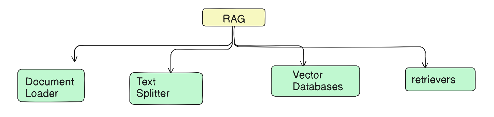
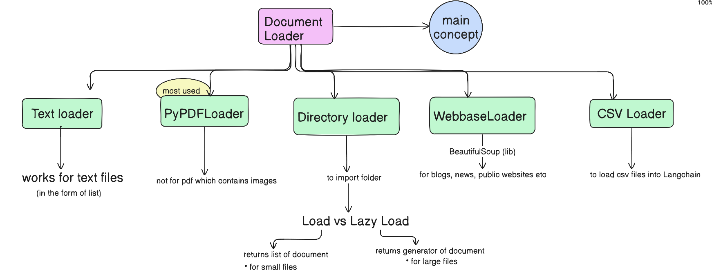

---

### Key Highlights and Core Concepts

- **LangChain and RAG Applications**:
  - LangChain is a framework for building large language model (LLM) applications.
  - RAG (Retrieval-Augmented Generation) applications combine external knowledge retrieval with language generation to produce accurate, grounded responses.
  - RAG is useful when LLMs (like ChatGPT) cannot answer questions due to lack of updated or personal data context.
  - RAG allows connecting an LLM with an **external knowledge base** (e.g., PDFs, databases, personal documents), enabling retrieval of relevant information and then generating answers.

- **Why Use RAG?**
  - Handles up-to-date information that LLMs might not have.
  - Maintains privacy by querying documents locally without uploading sensitive data to external servers.
  - Supports large documents by chunking them, overcoming context length limitations of LLMs.
  

- **Four Core Components of RAG in LangChain**:
  1. **Document Loaders** – Load data from various sources in a standardized format.
  2. **Text Splitters** – Split documents into manageable chunks.
  3. **Vector Databases** – Store embeddings for efficient retrieval.
  4. **Retrievers** – Retrieve relevant chunks based on queries.

---

### Document Loaders in LangChain

- **Definition**: Components that load data from diverse sources and convert it into a **standardized document object format**, which includes:
  - **Page content** (actual data/text)
  - **Metadata** (source, creation date, author, page number, etc.)

- Document loaders ensure data from multiple heterogeneous sources (PDFs, text files, web pages, databases, cloud storage, etc.) is normalized for further processing in LangChain.

---

### Four Most Commonly Used Document Loaders Covered

| Document Loader | Description | Use Case | Output Format |
| --------------- | ----------- | -------- | ------------- |
| **Text Loader** | Loads plain text files into LangChain documents. | Logs, code snippets, transcripts (e.g., YouTube transcripts). | List of document objects (usually one document per file). |
| **PyPDF Loader** | Reads PDF files page-by-page and converts each page into a separate document object. | Textual PDFs with simple layouts. | List of document objects corresponding to each PDF page. |
| **Directory Loader** | Loads multiple documents from a folder based on a file pattern (e.g., `*.pdf`, `*.txt`). Utilizes other loaders internally. | Loading bulk documents in one go (multiple PDFs or text files). | List of document objects for all files combined. |
| **CSV Loader** | Loads CSV files, creating one document object per row, with content as concatenated column data and metadata indicating source and row number. | Data analysis and querying structured tabular data. | List of document objects, one per CSV row. |

---

### Important Details and Usage Notes

- **Output of all loaders** is always a **list of document objects** (even if a single document is loaded).
- Each document object has two main attributes: 
  - `$page\_content$` (string of actual text/data)
  - $metadata$ (dictionary containing source info, page number, creation details, etc.)
- **Load vs Lazy Load**:
  - `$load()$` eagerly loads all documents into memory at once—useful for small datasets.
  - `$lazy\_load()$` returns a generator that loads one document at a time on demand—ideal for large datasets or when memory efficiency is critical.
- **PyPDF Loader limitations**:
  - Best for textual PDFs.
  - Not suitable for scanned images or complex layouts.
  - Alternative loaders like PDFPlumber Loader, Unstructured PDF Loader, Amazon Textract PDF Loader, and PyMuPDF Loader exist for specific PDF types and use cases.
- **Directory Loader** supports loading multiple files in batch using glob-style patterns (e.g., `*.pdf` to load all PDFs in a folder).
- Loading many large documents simultaneously can be slow and memory-intensive; lazy loading mitigates these issues.
- **WebBase Loader**:
  - Loads content from static web pages using Python libraries `requests` and `Beautiful Soup`.
  - Returns a single document per URL.
  - Useful for blogs, news, and static sites.
  - Limited with JavaScript-heavy or dynamically loaded pages; Selenium URL Loader is an alternative in those cases.
- **Custom Document Loaders**:
  - LangChain allows users to create custom loaders by inheriting from a base loader class.
  - Users can override `load` and `lazy_load` methods with their own logic.
  - This extensibility has led to a large community-contributed pool of loaders for diverse data sources.
- Extensive documentation and tutorials for additional loaders are available online, facilitating project-specific learning.

---

---

### Important Definitions and Concepts

| Term                     | Definition / Explanation                                                                                   |
|--------------------------|------------------------------------------------------------------------------------------------------------|
| **RAG (Retrieval-Augmented Generation)** | A technique that combines information retrieval from an external knowledge base with language generation by an LLM to produce accurate, context-aware answers. |
| **Document Loader**       | Utility in LangChain that extracts and standardizes data from diverse sources into document objects for further processing. |
| **Document Object**       | A standardized data structure containing: 1) $page\_content$ (text) and 2) $metadata$ (source info, page number, etc.). |
| **Load (Eager Loading)**  | Method to load all documents into memory at once, returning a list of document objects.                     |
| **Lazy Load**             | Method returning a generator that loads documents one-by-one on demand, optimizing memory usage.            |
| **WebBase Loader**        | Loads and parses text content from static web pages using HTTP requests and HTML parsing.                   |
| **Custom Loader**         | User-defined loader class inheriting LangChain base loader with custom logic for unsupported data sources.  |

---

### Key Insights

- **Understanding Document Loaders is fundamental** for building effective RAG-based applications with LangChain.
- The **standardized document object format** simplifies downstream processing regardless of the original data source.
- **Lazy loading is crucial** when dealing with large datasets or many documents to avoid memory overload and improve performance.
- LangChain’s modularity and community-driven ecosystem provide **extensive support for multiple document types and sources**.
- Building RAG applications incrementally by mastering components (starting with document loaders) is more effective than trying to build a full system immediately.

---
