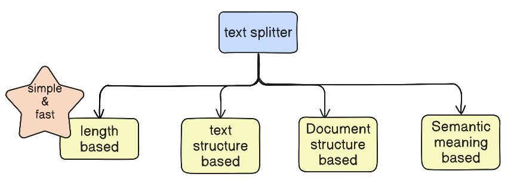

---

### Core Concepts and Key Insights

- **Text Splitting Definition:**  
  Text splitting is the process of breaking large chunks of text (e.g., articles, PDFs, HTML pages, books) into smaller manageable pieces or chunks that an LLM can handle effectively.

- **Importance of Text Splitting:**  
  - LLMs have a **context length limit** (e.g., 50,000 tokens/words), beyond which processing a large document at once is impossible or degrades output quality.  
  - Splitting large texts into smaller chunks improves the quality of embeddings, semantic search, and summarization tasks.  
  - Smaller chunks reduce computational resources and allow parallel processing.

- **Three Main Reasons to Use Text Splitting in LLM Applications:**  
  1. **Model Limitations:** Overcome LLMs' maximum input size.  
  2. **Improved Downstream Task Accuracy:** Embeddings, semantic search, and summarization perform better on smaller chunks.  
  3. **Optimization of Computation:** Smaller chunks require less memory and enable parallel execution.

- **Chunk Overlap:**  
  - Overlapping characters between chunks helps retain context that might be lost due to abrupt splits (e.g., splitting in middle of words or sentences).  
  - Typical overlap is recommended around **10–20%** of chunk size.  
  - Trade-off: More overlap means better context retention but increased number of chunks and computation.

---

### Text Splitting Techniques Covered

| Technique                         | Description                                                                                                   | Advantages                                                   | Disadvantages                                               |
|----------------------------------|---------------------------------------------------------------------------------------------------------------|--------------------------------------------------------------|-------------------------------------------------------------|
| **Length-Based Splitting**        | Splitting text purely by fixed size (characters or tokens), e.g., every 100 characters.                       | Simple, fast, easy to implement.                              | Ignores linguistic structure; may cut words/sentences awkwardly. |
| **Structure-Based Splitting**     | Hierarchical splitting based on text structure: paragraphs → sentences → words → characters. Uses recursive algorithm to avoid abrupt cuts. | Respects linguistic units; better context preservation.      | More complex than length-based; chunk sizes can vary.       |
| **Document-Based Splitting**      | Specialized for non-plain-text documents (e.g., code, markdown) using domain-specific separators (e.g., class, def keywords). | Tailored to structured documents; handles code and markup well. | Requires domain knowledge for separators; more complex.     |
| **Semantic Meaning-Based Splitting** | Splits text based on semantic similarity, using embedding vectors and cosine similarity to find topic shifts to split. | Ideally splits at topic boundaries, improving chunk coherence. | Experimental, computationally expensive, not very stable currently. |

---

### Detailed Explanation of Techniques

- **Length-Based Splitting:**  
  - Define chunk size (e.g., 100 characters).  
  - Traverse text and split at fixed size points.  
  - Can specify chunk overlap to retain context.  
  - Example: If chunk size is 100 and overlap is 20, next chunk starts 80 characters after current chunk start.  
  - Limitation: May split words or sentences, causing semantic loss.

- **Recursive Character Text Splitting (Structure-Based):**  
  - Uses hierarchical separators: paragraphs (`\n\n`), lines (`\n`), spaces, and characters.  
  - Tries to split at highest possible linguistic level without exceeding chunk size.  
  - Merges smaller chunks to optimize size near the limit.  
  - Example demonstrated with a sample text split with chunk sizes 10, 25, 50 showing varying chunk granularity.  
  - Widely used due to balance of simplicity and preservation of linguistic structure.

- **Document-Based Splitting:**  
  - Extends recursive splitting to specialized documents like code or markdown.  
  - Uses language-specific keywords (`class`, `def`, markdown headers) as separators.  
  - Example: Splitting Python code into chunks based on classes and methods.  
  - Allows meaningful chunks for LLM processing of structured documents.

- **Semantic Meaning-Based Splitting:**  
  - Split decisions based on semantic similarity of consecutive sentences using embedding vectors.  
  - Compute cosine similarity between sentence embeddings to detect topic shifts.  
  - Uses statistical thresholds (e.g., standard deviation) on similarity scores to identify split points.  
  - Experimental and not yet consistently reliable but promising for future applications.

---

### Practical Usage in LangChain

- **LangChain provides built-in classes for these splitters:**  
  - `CharacterTextSplitter` for length-based splitting with configurable chunk size and overlap.  
  - `RecursiveCharacterTextSplitter` for structure-based splitting following paragraph, sentence, word hierarchy.  
  - Recursive splitter can be customized for special document types (code, markdown) by defining appropriate separators.  
  - Experimental semantic splitters are available but not production-ready.

- **Example Workflow:**  
  1. Load large document with Document Loaders (e.g., PDF loader).  
  2. Use a text splitter to split the loaded document into chunks.  
  3. Process chunks individually for embeddings, semantic search, or summarization.  

- **Code Examples:** (Summary)  
  - Import splitter class, define chunk size and overlap.  
  - Call `split_text()` or `split_documents()` passing raw text or document objects.  
  - Inspect resulting chunk list and process accordingly.

---

### Quantitative/Comparative Table of Text Splitter Features

| Splitter Type                  | Considers Linguistic Structure | Supports Overlap | Suitable for Structured Docs (Code/Markdown) | Maturity Level       |
|-------------------------------|-------------------------------|------------------|----------------------------------------------|---------------------|
| Length-Based (`CharacterTextSplitter`) | No                            | Yes              | No                                           | Stable & simple     |
| Structure-Based (`RecursiveCharacterTextSplitter`) | Yes                           | Yes              | Partial (with custom separators)             | Stable & widely used |
| Document-Based (Code, Markdown Splitters) | Yes (domain-specific)          | Yes              | Yes                                          | Stable & specialized |
| Semantic Meaning-Based         | Yes                           | Not typical      | Potentially                                   | Experimental         |

---

### Summary of Benefits and Trade-offs

- **Length-Based Splitting:**  
  + Fast & easy  
  – Can cut words/sentences, losing context

- **Structure-Based Splitting:**  
  + Respects linguistic units  
  + Produces semantically coherent chunks  
  – More complex, slower than length-based

- **Document-Based Splitting:**  
  + Handles specialized documents effectively  
  – Requires domain knowledge, setup overhead

- **Semantic Meaning-Based Splitting:**  
  + Best for topic-aware splitting  
  – Experimental, higher computational cost, less stable results currently

---

### Final Recommendations

- Use **recursive character text splitting** for most general-purpose plain-text splitting needs due to its balance between simplicity and coherence.  
- For **code or markup languages**, use document-based splitters with domain-specific separators.  
- Length-based splitters can be useful for very simple or fast workflows with tolerance for context loss.  
- Semantic splitting is promising for the future but currently experimental; use with caution.  
- Always set chunk size and overlap thoughtfully to balance context preservation and computational efficiency. Typical chunk overlap is 10–20 characters/tokens.

---

### Keywords

- **Text Splitting**  
- **Chunking**  
- **Large Language Models (LLMs)**  
- **Context Length Limit**  
- **Chunk Overlap**  
- **Recursive Character Text Splitter**  
- **Length-Based Splitting**  
- **Document-Based Splitting**  
- **Semantic Meaning-Based Splitting**  
- **Embeddings**  
- **Semantic Search**  
- **Summarization**  
- **LangChain**

---

### Summary Table: Why Text Splitting Matters in LLM Applications

| Reason No. | Reason Description                                                                                     |
|------------|------------------------------------------------------------------------------------------------------|
| 1          | Overcomes LLM input size limits (context length constraints)                                         |
| 2          | Enables better performance for downstream tasks like embeddings, semantic search, summarization     |
| 3          | Optimizes computational resources by enabling parallelization and reducing memory demand             |

---
