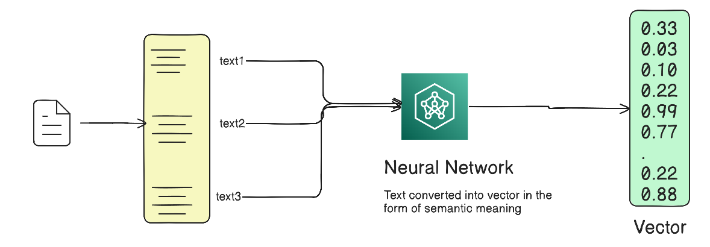
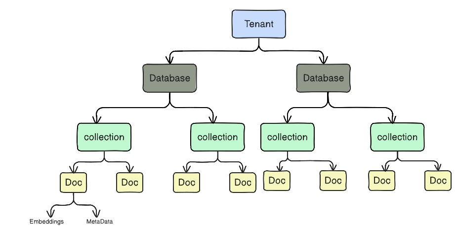

---

### Key Concepts and Insights

- **Vector Stores** are systems designed to **store and retrieve data represented as numerical vectors**. They enable efficient semantic similarity searches, which are crucial for modern AI-driven applications like recommendation systems.

- **Limitations of Keyword Matching** in recommender systems:
  - Keyword matching compares movies based on attributes like director, actors, genre, and release date.
  - However, this method often produces **illogical recommendations** because two movies may share keywords but differ drastically in story and style.
  - Conversely, movies with very similar storylines but different metadata (e.g., directors, actors) are not matched.
  
- **Semantic Search Using Plots**:
  - A better approach is to compare movies based on the **semantic similarity of their plots**.
  - Plot summaries are converted into **embedding vectors** using deep learning models (e.g., neural networks).
  - These embeddings capture the **hidden meaning** of the text and allow more accurate similarity comparisons.
  
- **Embedding Vectors and Similarity Calculation**:
  - Embeddings are high-dimensional vectors (e.g., 512 or 784 dimensions).
  - Movie plots are converted into these vectors.
  - Similarity between vectors is calculated using metrics like **cosine similarity** or **angular distance**.
  - Movies with high similarity scores are considered good recommendations.

- **Challenges in Building Vector-Based Systems**:
  - **Generating embeddings** for millions of items is computationally intensive.
  - **Storage**: embeddings cannot be efficiently stored in traditional relational databases; vector stores provide specialized storage.
  - **Semantic Search**: performing similarity searches across millions of vectors is expensive if done naively (linear search).
  - **Indexing Techniques** like **clustering** reduce search complexity drastically by grouping vectors and comparing query vectors only with relevant clusters.
  
- **Definition of Vector Store** (as per the video):
  
  > "A vector store is a system designed to store and retrieve data represented as numerical vectors."
  
- **Core Features of Vector Stores**:
  1. **Storage**: store vectors and associated metadata (e.g., movie ID, name).
  2. **Similarity Search**: retrieve vectors most similar to a query vector.
  3. **Indexing**: data structures enabling fast similarity searches on high-dimensional vectors.
  4. **CRUD Operations**: add, update, retrieve, and delete vectors and metadata.

- **Use Cases of Vector Stores**:
  - Recommender systems.
  - Semantic search in any application requiring vector similarity.
  - Multimedia search (images, audio, video).
  - RAG-based applications (LangChain specifically).

---

### Vector Store vs Vector Database

| Feature/Aspect            | Vector Store                                  | Vector Database                             |
|--------------------------|-----------------------------------------------|---------------------------------------------|
| Definition               | Lightweight system for storing & retrieving vectors and performing similarity search | Full-fledged database with vector storage plus advanced database features |
| Features                 | Storage, retrieval, similarity search         | Storage, retrieval, similarity search plus distributed architecture, transaction support, backup/restore, authentication, etc. |
| Typical Use Cases        | Prototyping, small to medium scale applications | Production-grade, large-scale, multi-user applications |
| Examples                 | Facebook's Faiss (library)                     | Milvus, Weaviate, Pinecone                   |
| Additional DB Features   | Usually lacks complex DB features like transactions, RBAC, distributed scaling | Supports advanced DB features like distributed architecture, durability, security |

**Summary:**  
Every vector database is a vector store with added database-like features, but not every vector store is a full vector database.

---

### Vector Stores in LangChain

- LangChain provides **built-in components (wrappers)** for many popular vector stores/databases such as **Faiss, Pinecone, Weaviate, Milvus, and Chroma**.
- These wrappers share a **common interface and method signatures**, e.g., `from_documents`, `add_documents`, `similarity_search`, enabling easy switching between different vector stores without major code changes.
- This abstraction helps developers build scalable RAG applications efficiently.

---

### Chroma DB: Example Vector Store/Database

- **Chroma DB** is introduced as a lightweight, open-source vector database optimized for local development and small to medium scale production.
- It provides a middle ground between a pure vector store and a full vector database.
- Data organization hierarchy in Chroma DB:
  - **Tenant** (top level: user or organization)
  - **Database**
  - **Collection** (similar to tables in RDBMS)
  - **Documents** (contain embedding vectors and metadata)

- LangChain integration with Chroma demonstrates operations:
  - Creating vector stores and collections.
  - Adding documents with embeddings and metadata.
  - Performing similarity search queries with parameters specifying **number of results ($k$)**.
  - Filtering results based on metadata (e.g., filtering cricket players by IPL teams).
  - Updating and deleting documents by ID.
  
- Chroma stores vectors internally using **SQLite** format, allowing easy inspection if needed.

---

### Practical Demonstration Highlights

- Documents created about cricket players with metadata fields (player name, IPL team).
- Use of OpenAI embeddings to convert text into vectors.
- Similarity search returns semantically closest documents.
- Filtering by metadata (e.g., team) refines query results.
- Updates and deletes on vector documents are straightforward using LangChain APIs.

---

### Timeline of Core Steps for Building Vector-Based Recommender (Extracted from the Talk)

| Step | Description                                                                                |
|-------|--------------------------------------------------------------------------------------------|
| 1     | Collect movie data, including detailed plot summaries.                                    |
| 2     | Generate embedding vectors for each movie plot using a neural network model.              |
| 3     | Store embeddings and metadata in a vector store (not relational DB).                      |
| 4     | Use similarity metrics (cosine similarity) to find similar movie plots.                   |
| 5     | Implement indexing (e.g., clustering) to speed up similarity search over millions of vectors. |
| 6     | Build APIs/backend to serve similarity results to the frontend.                           |
| 7     | Use LangChain wrappers to integrate vector stores/databases flexibly.                     |

---

### Summary Table: Challenges and Solutions in Vector Store-based Systems

| Challenge                   | Description                                                   | Solution                                |
|-----------------------------|---------------------------------------------------------------|----------------------------------------|
| Embedding Generation        | Generating embeddings for millions of documents is resource-intensive | Batch processing and efficient embedding models |
| Storage                     | Traditional relational DBs inefficient for vector storage     | Use specialized vector stores/databases |
| Semantic Search Efficiency  | Linear search over millions of high-dimensional vectors is slow | Indexing techniques (clustering, Approximate Nearest Neighbor) |
| Scalability & Reliability   | Need for distributed, durable, secure storage and operations  | Full vector databases with DB features |

---

### Conclusion

- **Vector stores are indispensable for modern AI applications involving semantic search and recommendations**, particularly in RAG systems.
- They provide efficient storage and retrieval of high-dimensional embeddings and enable similarity search at scale.
- **LangChain offers a unified, flexible API to work with various vector stores/databases**, facilitating easy experimentation and production deployment.
- **Chroma DB** serves as a practical example of a lightweight, user-friendly vector database integrated with LangChain.
- Understanding the **difference between vector stores and vector databases** is crucial for selecting the right tooling based on application scale and feature needs.

---

### Keywords

- Vector Store  
- Vector Database  
- Embeddings  
- Semantic Search  
- Similarity Search  
- Cosine Similarity  
- Indexing  
- Clustering  
- RAG (Retrieval-Augmented Generation)  
- LangChain  
- Chroma DB  
- CRUD Operations  
- Metadata Filtering  
- Approximate Nearest Neighbor (ANN)  
- Movie Recommendation System  

---

### Suggested Next Steps

- Implement the demonstrated code using other vector stores like **Faiss** or **Pinecone** to understand differences.
- Explore advanced indexing techniques for further optimization.
- Build a full RAG application using LangChain with vector store integration.

---

